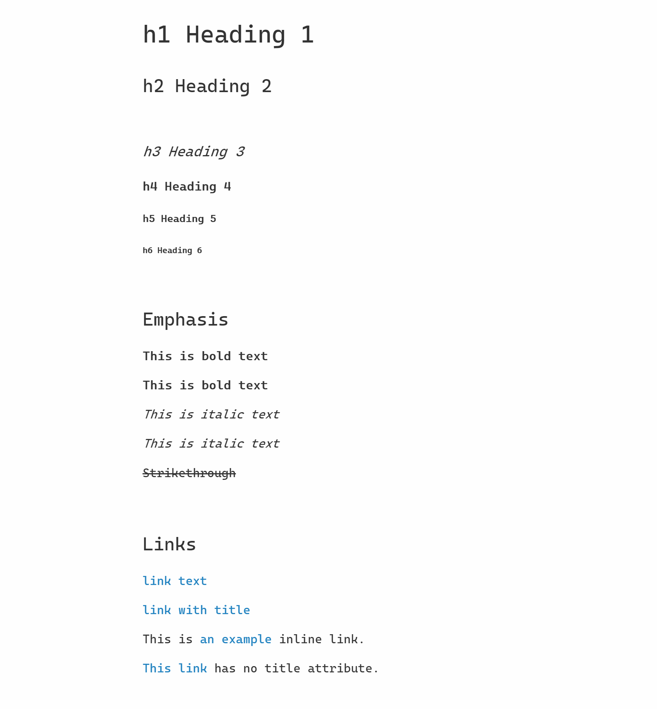
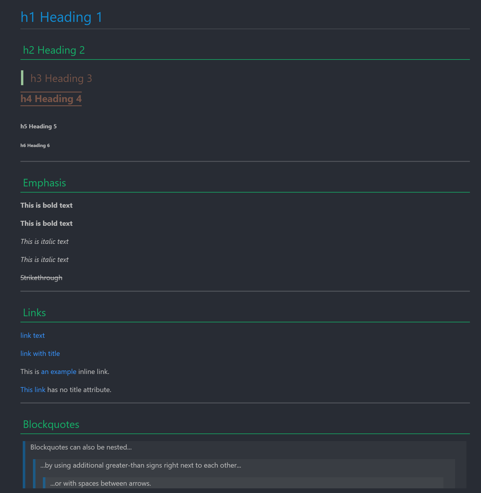

## VSCode Markdown CSS

VSCode markdown 预览 css 文件合集.

源码见 [editor on GitHub](https://github.com/PrivateRookie/vsc-markdown-css/edit/master/README.md) 

## 使用

选择下方一个样式并将连接复制到剪切板上, 打开 VSCode 设置,将 "markdown.styles" 如下内容, 注意将链接改为刚才复制的网址.

```json
"markdown.styles": [
  "https://privaterookie.github.io/vsc-markdown-css/style.css"
]
```

---

## 主题

### white theme

[white theme](https://privaterookie.github.io/vsc-markdown-css/white/style.css)

**preview**




### cmdmarkdown theme

[cmd markdown theme](https://privaterookie.github.io/vsc-markdown-css/cmdmarkdown/style.css)

**preview**


